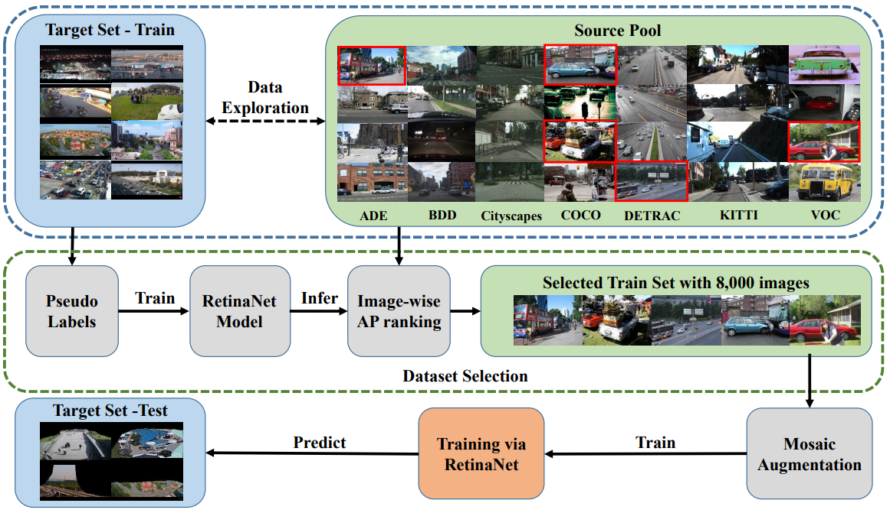

# Solution of 1st Place for The 2nd CVPR DataCV Challenge 

This is the code for reproducing our solution for the 2nd CVPR DataCV Challenge.

## Installation
### Requirements

We have tested the following versions of OS and software:
- OS: Linux 3.10.0
- Nvidia drivers: 470.57.02
- 1 x NVIDIA Tesla V100 SXM2 32GB

- Python 3.8.0
- pytorch 1.12.1
- mmdet: 2.26.0
- mmcv-full 1.7.0

To create an environment to reproduce our best results, first set up the conda environment according to the [baseline project](https://github.com/yorkeyao/DataCV2024), **but note that Python version here should be 3.8**.  And we also use [YOLOv8](https://github.com/ultralytics/ultralytics), you also need to install ultralytics,

```bash
conda create -n tss python=3.8 -y
pip install terminaltables pycocotools ultralytics==8.1.36 
```

#### Dataset setup

1. Download region_100.zip and source_pool.zip via links from  `https://github.com/yorkeyao/DataCV2024/tree/main`

2. Download the standard coco annotation of train2017: "instances_train2017.json"
```bash
wget http://images.cocodataset.org/annotations/annotations_trainval2017.zip -O /data/vdu2024/source_pool/annotations_trainval2017.zip 
cd /data/vdu2024/source_pool
unzip annotations_trainval2017.zip
```

3. Extract zip file into "/data/vdu2024/", you may need to create this directory if not exists.

4. Move images from "/data/vdu2024/region100/train/001-100/***.jpg" into "train/" for YOLOv8 to predict.
```bash
cd train
mv */*.jpg ./
```

5. Update the annotation of coco for this competition. The coco_update.py is in the project's main directory. Then it will generate the "/data/vdu2024/source_pool/coco_updated.json" for the competition.

```bash
python coco_update.py
```

## Running the code

### 1. Peusdo Labels Generation
- Download YOLOv8x checkpoint and infer on train set of Region 100. After inference, it will generate peusdo labels under "./runs/predict/labels" from the main directory. Move "predict" folder for label format conversion.
```bash
wget https://github.com/ultralytics/assets/releases/download/v8.1.0/yolov8x.pt
yolo detect predict model=./yolov8x.pt source=/data/vdu2024/region_100/train conf=0.1 imgsz=1280 save_txt=True classes=[2,5,7] save=False
mv runs/detect/predict ap_sort/
```

- Run "yolo2coco.py" to convert YOLO-formatted labels into COCO-formatted json file, "train_yolov8.json" under "/data/vdu2024/region_100/".
```bash
python ap_sort/yolo2coco.py
```

### 2. Training RetinaNet with Peusdo Labels with train set of Region 100 and inferring on COCO dataset.
```bash
python tools/train.py configs_tss/retinanet/001_train2source.py
python tools/test.py configs_tss/retinanet/001_train2source.py work_dirs/001_train2source/latest.pth --format-only --options "jsonfile_prefix=./"
mv .bbox.json ap_sort/infer_coco.json
```

### 3. Selecting 8000 images with the highest image-wise AP from COCO dataset.
```bash
python ap_sort/ap_sort_coco.py 
```

### 4. Training model
#### 4.1 Without Mosaic Augmentation
```bash
python tools/train.py configs_tss/retinanet/002_coco_8000.py
```
#### 4.2 With Mosaic Augmentation
```bash
python mosaic.py
python tools/train.py configs_tss/retinanet/003_coco_8000_mosaic.py
```


## Evaluation
Due to a severe crash of our server, we have unfortunately lost the original model weights referenced in the paper. As a result, the performance metrics associated with the "checkpoints" differ slightly from those previously reported.

| Models   |  testA   |  test B  |
|----------|----------|----------|
| AP-COCO (paper)  |22.96    |   22.57     |
| AP-COCO (This repo)    | 23.2     | N/A     |
| AP-COCO+Mosaic (paper)  |22.62     |   22.85     |
| AP-COCO+Mosaic (This repo)    | 23.1     | N/A     |
